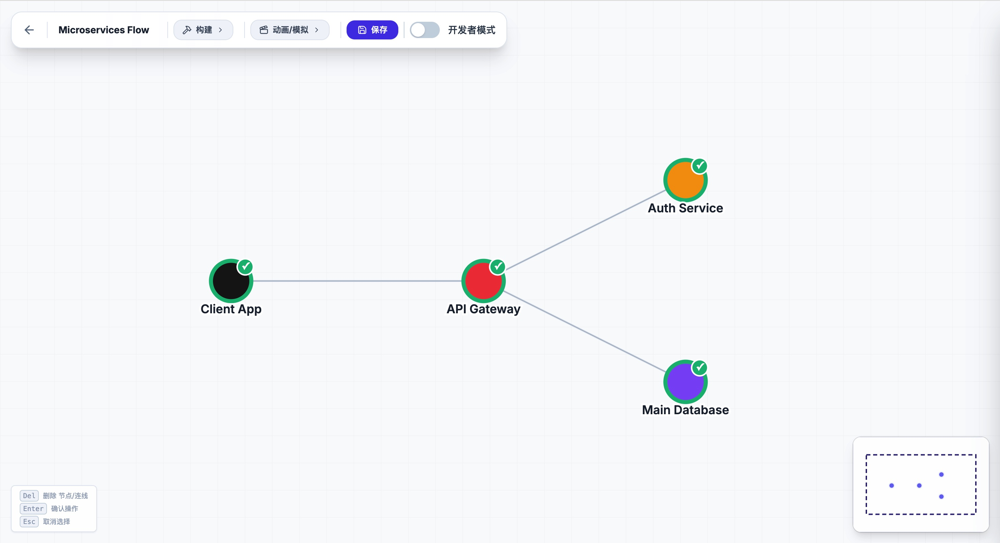

# Mijin — GraphFlow Visualizer

A browser-based tool for building, styling, and animating directed node graphs. Design network topologies, define visual themes, and author step-by-step simulations — all without writing any rendering code.



## Features

- **Interactive graph editor** — drag nodes, draw links, create environment zones and labels
- **AI Import** — upload an architecture diagram or document; an LLM identifies the components and relationships and generates the graph structure automatically; supports any OpenAI-compatible API endpoint (Anthropic, OpenAI, OpenRouter, local Ollama, etc.)
- **Visual theme system** — define named node/link styles with persistent appearance and animation properties (packet color, node badge, scale effects)
- **Animation scripting** — author `AtomicStep` and `ParallelStep` sequences; each step supports three-phase node state transitions (impact → processing → final)
- **Director Mode** — visually build animation scripts by clicking nodes on the canvas; preview each step live as you add it
- **Dev Mode** — raw JSON editors for graph topology, theme config, and animation script with inline validation
- **Environment layers** — lockable zones that capture and move attached nodes, labels, and sub-zones together
- **Project management** — create, pin, rename, and delete multiple graph projects; all data persisted to `localStorage`
- **Internationalization** — UI supports English and Chinese (auto-detected from browser language)

## Getting Started

**Prerequisites:** Node.js

```bash
npm install
npm run dev
```

Open `http://localhost:5173` in your browser.

## Usage

### Editor Modes

| Mode | How to activate | Purpose |
|---|---|---|
| **构建 (Build)** | Click the Build button in the toolbar | Add nodes, draw links, import graph from AI |
| **动画/模拟 (Animate)** | Click the Animate button in the toolbar | Access Director Mode and simulation tools |
| **Dev Mode** | Toggle in the toolbar | Edit graph topology, theme, and animation script as raw JSON |

### AI Import

Open **构建 → AI Import** to generate a graph from an image or document.

1. Choose a preset or enter a custom **Base URL**, **API Key**, and **Model**
2. Upload a file (PNG, JPG, PDF, TXT, MD) — drag & drop or click to browse
3. Click **Analyze** — the model identifies nodes and relationships
4. Review the generated JSON preview, then click **Apply to Graph**

Supported API formats:
- URLs containing `anthropic.com` use the Anthropic Messages API
- All other URLs use the OpenAI Chat Completions API (compatible with OpenRouter, Ollama, etc.)

> **Note:** API calls are routed through the Vite dev-server proxy (`/ai-proxy`) to avoid browser CORS restrictions. This works out of the box with `npm run dev`; a server-side reverse proxy is required for production deployments.

### Defining a Visual Theme

Themes are JSON objects with `nodeStyles` and `linkStyles`. Each style has a `persistent` block (what remains after animation) and an `animation` block (transient effect).

```json
{
  "nodeStyles": {
    "success": {
      "persistent": {
        "stroke": "#10b981",
        "strokeWidth": 4,
        "badge": { "text": "✓", "color": "#10b981", "textColor": "#fff" }
      },
      "animation": { "scale": 1.2, "durationIn": 0.3 }
    }
  },
  "linkStyles": {
    "http": {
      "persistent": { "mainColor": "#475569", "outlineColor": "#6366f1", "outlineWidth": 2 },
      "animation": { "packetColor": "#6366f1", "packetRadius": 6, "duration": 1.2 }
    }
  }
}
```

### Authoring an Animation Script

Scripts are `EventSequence` objects. Each step is either an `AtomicStep` (one directed flow) or a `ParallelStep` (multiple flows fired simultaneously).

```json
{
  "name": "My Flow",
  "initNodes": [
    { "id": "1", "nodeState": "loading" }
  ],
  "steps": [
    {
      "from": "1", "to": "2",
      "label": "Send Request",
      "linkStyle": "http",
      "targetNodeState": "loading",
      "processingNodeState": "processing",
      "finalNodeState": "success",
      "duration": 1.2,
      "durationProcessing": 0.5,
      "durationFinal": 0.4
    },
    {
      "type": "parallel",
      "label": "Parallel ops",
      "steps": [
        { "from": "2", "to": "3", "linkStyle": "http" },
        { "from": "2", "to": "4", "linkStyle": "http" }
      ]
    }
  ]
}
```

## Tech Stack

- **React 19** + **TypeScript**
- **Vite** — dev server and build
- **D3 v7** — force-directed layout and SVG rendering
- **GSAP** — packet and node impact animations
- **CodeMirror 6** — JSON editors in Dev Mode
- **Lucide React** — icons

## Scripts

```bash
npm run dev      # Start dev server
npm run build    # Production build
npm run preview  # Preview production build
```
